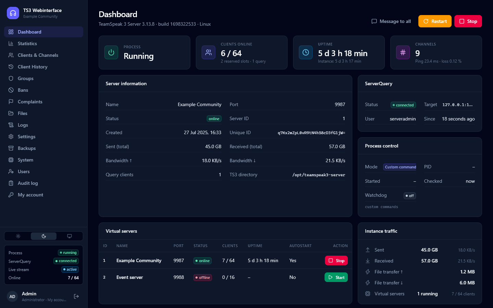
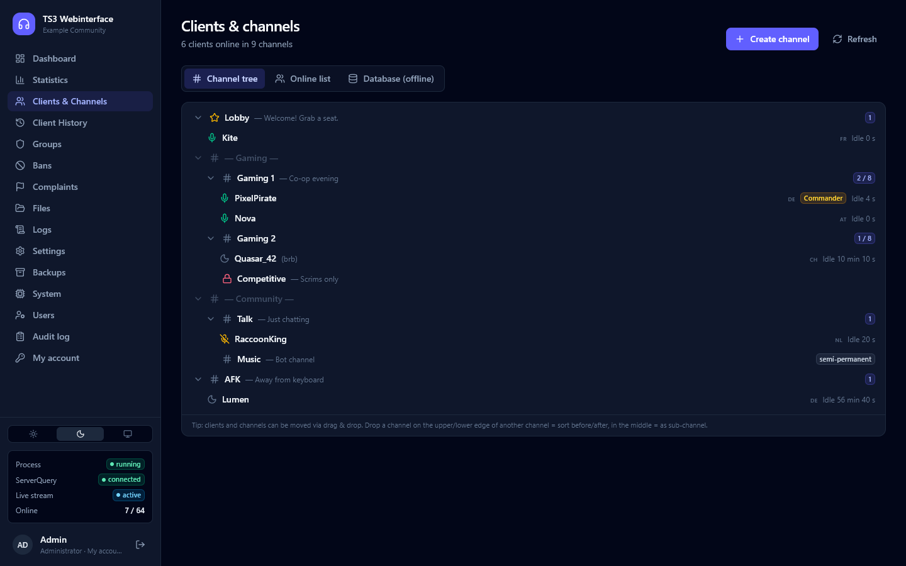
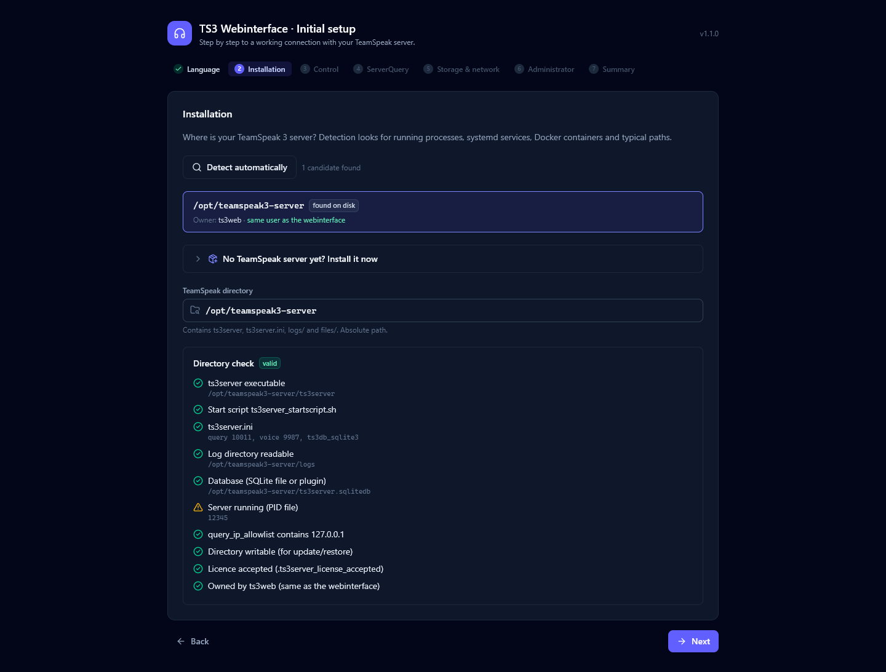
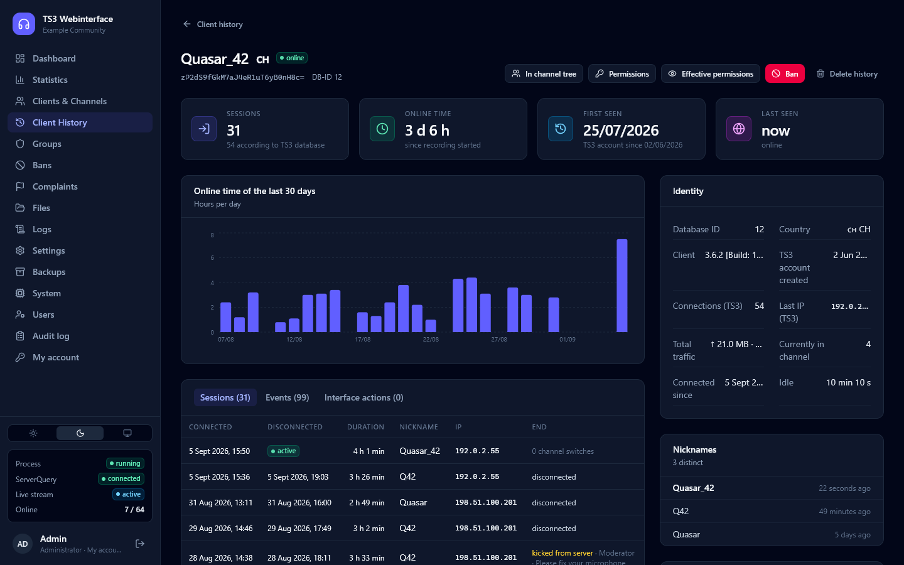
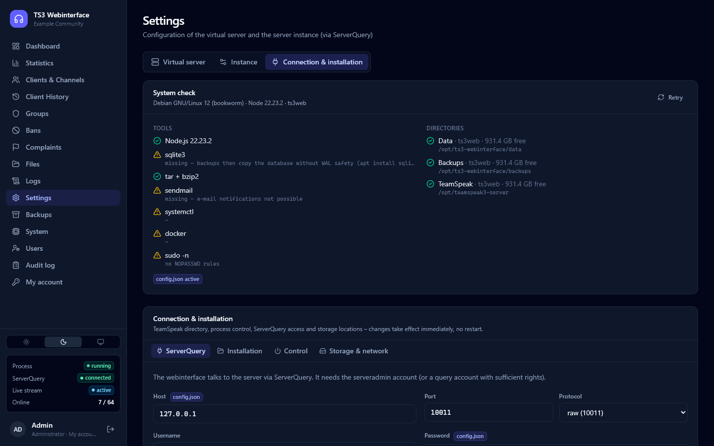

# TS3 Webinterface

[English](README.md) · **Deutsch**

Modernes Webinterface zur Verwaltung eines **TeamSpeak-3-Servers** – Node.js/Express-Backend mit ServerQuery-Anbindung,
React-Oberfläche (dunkles und helles Design, responsive), vollständig in **Deutsch und Englisch**.

- **Ein-Zeilen-Installation** auf Debian/Ubuntu/RHEL-kompatiblen Servern, **Einrichtungsassistent** im Browser – der Assistent
  kann sogar einen **TeamSpeak-3-Server installieren**, falls noch keiner vorhanden ist.
- Server starten/stoppen/neu starten, Watchdog, Backups mit Zeitplan und Wiederherstellung, TeamSpeak-Updates aus dem Browser.
- Kanalbaum mit Drag & Drop, Client-Aktionen, Gruppen, kompletter Rechte-Editor, Bans, Beschwerden, Dateien/Icons, Logs, Statistiken.
- Client-Historie und Profile, Benachrichtigungen (Discord, Telegram, E-Mail, Webhook), Einladungslinks, rollenbasierte Rechte, Audit-Log.

## Screenshots

Alle Screenshots zeigen einen Demo-Server mit erfundenen Daten.

| Dashboard | Clients & Kanäle |
|---|---|
|  |  |

| Einrichtungsassistent | Client-Profil |
|---|---|
|  |  |

| Einstellungen → Verbindung & Installation |
|---|
|  |

## Inhalt

- [Screenshots](#screenshots)
- [Schnellstart](#schnellstart)
- [Was der Installer macht](#was-der-installer-macht)
- [Einrichtungsassistent](#einrichtungsassistent)
- [Funktionen](#funktionen)
- [Voraussetzungen](#voraussetzungen)
- [Manuelle Installation](#manuelle-installation)
- [Konfiguration](#konfiguration)
- [Update, Rollback, Deinstallation](#update-rollback-deinstallation)
- [Reverse-Proxy & HTTPS](#reverse-proxy--https)
- [Steuerungsmodi](#steuerungsmodi)
- [Backups](#backups)
- [Sicherheit](#sicherheit)
- [Entwicklung](#entwicklung)
- [Fehlersuche](#fehlersuche)
- [Lizenz](#lizenz)

## Schnellstart

Auf dem Server, auf dem der TeamSpeak-3-Server läuft (oder laufen soll):

```bash
curl -fsSL https://raw.githubusercontent.com/dinh1405/ts3-Webinterface/main/deploy/install.sh | sudo bash
```

Der Installer stellt ein paar Fragen (Sprache, nginx-Reverse-Proxy mit Domain, direkter Zugriff ja/nein) und gibt am Ende einen
Link wie `http://dein-server:8088/setup#token=…` aus. Im Browser öffnen – der **Einrichtungsassistent** führt durch den Rest.
Danach meldest du dich mit dem angelegten Administrator-Konto an.

Ohne Rückfragen (kein nginx, erreichbar auf Port 8088, deutsch):

```bash
curl -fsSL https://raw.githubusercontent.com/dinh1405/ts3-Webinterface/main/deploy/install.sh | sudo bash -s -- --yes --no-nginx --host 0.0.0.0 --lang de
```

Alle Optionen: `bash install.sh --help` (`--dir`, `--user`, `--port`, `--host`, `--nginx <Domain>`, `--no-nginx`, `--no-firewall`, `--service-name`, `--version`, `--from-file`, `--update`, `--uninstall`, …).

## Was der Installer macht

Der Installer kümmert sich nur um die Betriebssystem-Seite und rührt die TeamSpeak-Installation nicht an:

1. Installiert `curl`, `tar`, `bzip2`, `sqlite3` und **Node.js 22** (NodeSource), falls kein Node.js ≥ 20 vorhanden ist.
2. Wählt den **Systembenutzer**: Läuft ein `ts3server`-Prozess, bietet er denselben Benutzer an (nötig für Start/Stopp per
   Startskript und für Backups). Sonst legt er den Benutzer `ts3web` an.
3. Lädt das aktuelle **Release-Paket** von GitHub und prüft die **SHA-256**-Prüfsumme (kein Build auf dem Server).
4. Installiert nach `/opt/ts3-webinterface`, führt `npm ci --omit=dev` aus, erzeugt eine minimale `.env` (Port, zufälliger Sitzungsschlüssel).
5. Legt den **systemd-Dienst** `ts3-webinterface` an und startet ihn (`KillMode=process` – ein Neustart des Webinterface beendet
   nie den TeamSpeak-Server).
6. Richtet optional **nginx** als Reverse-Proxy für deine Domain ein (Plesk wird erkannt und übersprungen – siehe unten).
7. Installiert den Befehl **`ts3web`** und gibt die Setup-URL mit dem einmaligen **Setup-Token** aus.

## Einrichtungsassistent

Der Assistent läuft beim ersten Start im Browser und ist durch ein **Setup-Token** geschützt (vom Installer ausgegeben, in
`data/setup-token` mit Modus 0600 gespeichert, nach Abschluss gelöscht). Schritte:

| Schritt | Was passiert |
|---|---|
| **Sprache** | Systemsprache (Deutsch/Englisch, jeder Benutzer kann sie für sich ändern) und Zeitzone. |
| **Installation** | Erkennt TeamSpeak-Installationen (laufende Prozesse, systemd-Units, Docker-Container, typische Pfade) und prüft das Verzeichnis (Binary, Startskript, ini, Logs, Datenbank, Allowlist, Lizenz, Besitzer). **Noch kein Server?** Der Assistent lädt den aktuellen TeamSpeak-3-Server (SHA-256-geprüft), installiert ihn, startet ihn einmal mit zufälligem `serveradmin`-Passwort, zeigt den **Privilege-Key** und trägt alles Weitere automatisch ein. |
| **Steuerung** | Wie der Prozess gestartet/gestoppt wird: Startskript, systemd, Docker, eigene Befehle oder keine. Live-Prüfung mit dem genauen Befehl und – falls nötig – der einzutragenden sudoers-Regel. |
| **ServerQuery** | Verbindungstest mit dem serveradmin- (oder einem Query-)Konto, Auswahl des virtuellen Servers. Passwort unbekannt? Erstes Server-Log durchsuchen oder das **serveradmin-Passwort vom Assistenten zurücksetzen** lassen (Startskript-Modus). Die Brute-Force-Sperre von TeamSpeak wird beachtet (Countdown). |
| **Speicher & Netz** | Backup-Verzeichnis (beschreibbar? freier Platz), öffentliche URL, Reverse-Proxy-Schalter, E-Mail-Absender. |
| **Administrator** | Erstes Webinterface-Konto. |
| **Zusammenfassung** | Alles wird in `data/config.json` (Modus 0600) gespeichert und **ohne Neustart** angewendet. |

Alles lässt sich später unter **Einstellungen → Verbindung & Installation** ändern (nur Administratoren), inklusive Systemprüfung
(Node, Werkzeuge, sudo, Plattenplatz, Dateirechte).

## Funktionen

| Bereich | Funktionen |
|---|---|
| **Dashboard** | Prozessstatus, Uptime, Clients, Traffic, virtuelle Server, **Start / Stop / Neustart**, Nachricht an alle, Live-Aktivitätsfeed (SSE) |
| **Clients & Kanäle** | Live-Kanalbaum, Online-Liste, Client-Details, **kicken, anstupsen, Nachricht, verschieben, bannen**, Client-Datenbank (offline Clients suchen und bannen) |
| **Gruppen** | Servergruppen und Kanalgruppen: anlegen, umbenennen, kopieren, löschen; Mitglieder ansehen, Clients hinzufügen/entfernen; Kanalgruppen-Zuweisungen (Client ↔ Kanal); Servergruppen eines Clients direkt im Client-Dialog |
| **Rechte-Editor** | Berechtigungen von Servergruppen, Kanalgruppen, Clients, Kanälen und Client-im-Kanal anzeigen und bearbeiten (Wert, Skip, Negiert), Suche und Kategorien über alle ~500 Berechtigungen, Sammel-Speichern, einzelne Rechte entfernen; **effektive Rechte** eines Clients inkl. Herkunft (`permoverview`) |
| **Kanalverwaltung** | Kanäle anlegen (auch Unterkanäle), bearbeiten (Name, Thema, Beschreibung, Passwort, Typ, Codec, Limits, Talk Power, Icon, Banner …), verschieben/umsortieren, löschen – direkt im Kanalbaum |
| **Beschwerden** | Liste, einzeln oder je Client löschen, Ziel direkt bannen |
| **Client-Historie & Profile** | Jede Verbindung pro Identität (UID): Sitzungen mit Dauer und Trennungsgrund (Kick/Ban/Timeout), alle verwendeten **Nicknames und IPs**, Kanalwechsel, Onlinezeit pro Tag und Uhrzeit; Suche nach Nickname, UID, IP oder DB-ID (findet Wiederkehrer mit neuem Namen); Profilseite mit Live-Daten (Servergruppen, aktive Bans, Beschwerden, TS3-Datenbankinfo), zugehörigen Webinterface-Aktionen und **Notizen**; Top-Clients nach Onlinezeit; Historie einer Identität löschbar. Aufbewahrung `historyRetentionDays` (Standard 365) in `data/history/` |
| **Dateiverwaltung** | Dateibrowser für Kanal- und Server-Dateien (Avatare): Upload, Download, Ordner, Umbenennen, Löschen, Bildvorschau; Icons hochladen, ansehen, löschen und Gruppen/Kanälen zuweisen |
| **Einladungslinks** | Admins erzeugen Links mit Rolle, Ablauf und Verwendungslimit; Eingeladene registrieren sich unter `/register?token=…`; Links zurückziehen/löschen, Verlauf |
| **Bans** | Banliste, Ban hinzufügen (IP / Name / UID / myTeamSpeak-ID, Dauer, Grund), **entbannen**, alle löschen |
| **Logs** | Server-/Instanzlog per ServerQuery (live, Filter, ältere Einträge nachladen), Logdateien in `logs/` (Tail, Suche, Level-Filter, Download) |
| **Einstellungen** | Virtueller Server (Name, Willkommensnachricht, Passwort, Slots, Hostbanner/-button, Standardgruppen, Anti-Flood, Quota, Logging …) und Instanz (Dateitransfer-Port, Bandbreite, Query-Flood-Schutz) |
| **Backups** | ZIP-Backup (konsistente SQLite-Kopie, `files/`, ini, Lizenz, Query-Listen), **Download**, Upload, Löschen, **Wiederherstellen** (mit Sicherheitskopie), ServerQuery-Snapshots erstellen/einspielen, **Zeitplan** (täglich/wöchentlich, Aufbewahrung) |
| **Statistiken** | Minütliche Erfassung von Clients, Kanälen, Bandbreite, Ping und Prozessstatus; Diagramme 6 h bis 30 Tage, Spitzenzeiten-Heatmap (Wochentag × Stunde), Verfügbarkeit, Traffic-Summen; 90 Tage Aufbewahrung (`data/stats/`) |
| **Watchdog** | Prüft den TS3-Prozess regelmäßig, startet ihn nach Absturz neu (Limit pro Stunde, danach Benachrichtigung), Autostart beim Start des Webinterface-Dienstes (= nach Reboot); bewusstes Stoppen pausiert den Watchdog |
| **Benachrichtigungen** | Discord-Webhook, Telegram-Bot, E-Mail (lokales sendmail), generischer Webhook mit HMAC-Signatur; wählbare Ereignisse (Serverstopp/-neustart, Watchdog, Backups, Updates, Bans, Kicks, Login-Sperre, Query-Verlust); Testversand, Verlauf. **Systemweit** und **pro Benutzer** (Mein Konto) – jeweils in der Sprache des Empfängers |
| **Drag & Drop** | Clients in Kanäle ziehen, Kanäle umsortieren (oberer/unterer Rand) oder als Unterkanal einsortieren (Mitte) |
| **TS3-Update** | Versionsprüfung gegen den TeamSpeak-Versionsfeed, Update per Klick: Download, SHA-256, Entpacken, Sicherung, Stop, alte Dateien nach `.previous-version/`, neue Dateien, Start, Versionsbestätigung; automatischer Rollback bei Fehlern, manueller Rollback |
| **Benutzer** | Login, Rollen `admin` / `operator` / `viewer`, Sprache pro Benutzer, Passwort zurücksetzen, aktivieren/deaktivieren |
| **Audit-Log** | Wer hat wann was gemacht (inkl. fehlgeschlagener Logins) |

Rollen: **Administrator** (immer alle Rechte), **Operator** und **Beobachter** mit **frei konfigurierbaren Rechten** (Benutzer → Rollen & Rechte):
26 einzelne Rechte in 8 Gruppen. Standard: Operator = alle TeamSpeak-Funktionen ohne Verwaltung/Restore/Update, Beobachter = nur lesen.
Änderungen gelten sofort; Backend und Oberfläche prüfen dieselben Rechte (`server/lib/capabilities.js`).

## Voraussetzungen

- Linux mit systemd (Debian 11+, Ubuntu 20.04+, RHEL 8+/Rocky/Alma/Fedora). Andere Systeme: [manuelle Installation](#manuelle-installation).
- Node.js ≥ 20 (der Installer installiert 22 LTS).
- TeamSpeak-3-Server mit aktiviertem ServerQuery (raw 10011 oder ssh 10022) und `serveradmin`-Passwort – oder der Assistent installiert einen.
- Für Start/Stopp, Backups, Logs und Updates läuft das Webinterface **auf demselben Host** und **als derselbe Benutzer** wie der TS3-Server
  (oder mit sudoers-Regel für systemd/Docker). Reiner ServerQuery-Betrieb (Steuerung `none`) geht von jedem Host aus.
- `sqlite3`-CLI für konsistente Datenbank-Backups (installiert der Installer; sonst Fallback auf Dateikopie).

**Bekannte Grenzen des Installers** (manuelle Installation geht trotzdem):

- Andere Paketverwaltungen als apt/dnf (openSUSE/SLES, Arch, Alpine) unterstützt `install.sh` nicht.
- Distributionen mit zu alter glibc für Node.js 22 (CentOS/RHEL 7, Debian 10, Ubuntu 18.04) scheitern im Node.js-Schritt.
- Systeme ohne systemd (einfache Docker-Container, WSL, manche LXC-Vorlagen) unterstützt der Installer nicht.
- ARM64-Hosts (Raspberry Pi, Ampere, Graviton) können das Webinterface ausführen, TeamSpeak liefert aber nur x86_64-Linux-Builds;
  der Assistent kann dort keinen Server installieren, die Steuerung beschränkt sich auf ServerQuery zu einem anderen Host.
- Der Installer gibt die nötigen Ports in ufw/firewalld frei, wenn diese aktiv sind (`--no-firewall` zum Überspringen), und setzt für nginx
  den SELinux-Schalter `httpd_can_network_connect`; andere Firewalls (Cloud-Anbieter, reines iptables) müssen von Hand angepasst werden.

## Manuelle Installation

Ohne Installer (beliebiges Linux, macOS, Windows zur Entwicklung):

```bash
# 1. Release-Paket
curl -fsSLO https://github.com/dinh1405/ts3-Webinterface/releases/latest/download/ts3-webinterface-latest.tar.gz
tar -xzf ts3-webinterface-latest.tar.gz && cd ts3-webinterface-*/
npm ci --omit=dev

# 2. Minimale .env
cp .env.example .env            # HOST, PORT, JWT_SECRET setzen (openssl rand -hex 48)

# 3. Starten
node server/index.js            # gibt die Setup-URL mit Token aus
```

Für einen Dienst `deploy/ts3-webinterface.service.tpl` verwenden (`@APP_DIR@`, `@APP_USER@`, `@SERVICE@`, `@NODE@` ersetzen).
`KillMode=process` beibehalten, wenn der TeamSpeak-Server aus dem Webinterface gestartet wird.

## Konfiguration

Drei Schichten, höchste Priorität zuerst:

1. **`data/config.json`** – schreibt der Assistent bzw. Einstellungen → Verbindung & Installation (TeamSpeak-Verzeichnis, Steuerungsmodus, ServerQuery, Backup-Verzeichnis, öffentliche URL …).
2. **`.env`** – siehe [`.env.example`](.env.example). Nur für den Webserver selbst nötig; TeamSpeak-Werte können ebenfalls hier stehen (bestehende Installationen laufen weiter). Einstellungen → Verbindung zeigt die Herkunft jedes Werts und kann `.env`-Werte nach `config.json` übernehmen.
3. Eingebaute Standardwerte.

Nur per `.env` (Neustart nötig): `HOST`, `PORT`, `JWT_SECRET`, `SESSION_HOURS`, `LOGIN_RATE_MAX`, `LOGIN_RATE_WINDOW_MIN`, `DATA_DIR`, `UI_LANGUAGE` (Startsprache).

| Variable | Standard | Beschreibung |
|---|---|---|
| `HOST` / `PORT` | `127.0.0.1` / `8088` | Bind-Adresse und Port |
| `TRUST_PROXY` | `0` | `1` hinter nginx/Plesk (korrekte Client-IPs, `Secure`-Cookies) |
| `PUBLIC_URL` / `MAIL_FROM` | – / `ts3@<Domain>` | Öffentliche URL (Einladungslinks, Setup-URL) und E-Mail-Absender |
| `JWT_SECRET` | *(zufällig)* | Sitzungsschlüssel – **setzen**, sonst verfallen Sitzungen bei jedem Neustart |
| `SESSION_HOURS` | `12` | Sitzungsdauer |
| `LOGIN_RATE_MAX` / `LOGIN_RATE_WINDOW_MIN` | `10` / `15` | Login-Rate-Limit |
| `DATA_DIR` / `BACKUP_DIR` | `data` / `backups` | Datenhaltung und Backup-Ablage |
| `UI_LANGUAGE` | `en` | Systemsprache (`de`/`en`), bis sie im Assistenten gesetzt wird |
| `TS3_DIR` | – | TS3-Installationsverzeichnis |
| `TS3_CONTROL_MODE` | `script` | `script`, `systemd`, `docker`, `custom`, `none` |
| `TS3_START_SCRIPT` / `TS3_START_ARGS` / `TS3_PID_FILE` | `<TS3_DIR>/ts3server_startscript.sh` / `inifile=ts3server.ini` / `<TS3_DIR>/ts3server.pid` | Modus `script` |
| `TS3_SYSTEMD_UNIT` / `TS3_DOCKER_CONTAINER` / `TS3_USE_SUDO` | | Modi `systemd` / `docker` |
| `TS3_CMD_START\|STOP\|RESTART\|STATUS` | | Modus `custom` |
| `TS3_LOG_DIR` / `TS3_DB_FILE` / `SQLITE3_BIN` | `<TS3_DIR>/logs` / `<TS3_DIR>/ts3server.sqlitedb` / `sqlite3` | Logs & Backup |
| `TS3_QUERY_HOST` / `TS3_QUERY_PORT` / `TS3_QUERY_PROTOCOL` | `127.0.0.1` / `10011` / `raw` | ServerQuery |
| `TS3_QUERY_USER` / `TS3_QUERY_PASSWORD` / `TS3_QUERY_NICKNAME` | `serveradmin` / – / `Webinterface` | Zugangsdaten |
| `TS3_SERVER_PORT` / `TS3_SERVER_ID` | `9987` / `0` | Welcher virtuelle Server verwaltet wird |

## Update, Rollback, Deinstallation

```bash
sudo ts3web update                 # neueste Version (behält .env, data/, backups/; alte Version in .previous/)
sudo ts3web update --version 1.2.0 # bestimmte Version
sudo ts3web rollback               # zurück zur vorherigen Version
sudo ts3web status | logs | check  # Dienst, Health, Schnelldiagnose
sudo ts3web setup-token            # Assistenten-URL erneut anzeigen (--regenerate für ein neues Token)
sudo ts3web reset-admin admin      # Admin anlegen oder Passwort zurücksetzen
sudo ts3web uninstall [--purge]    # entfernen (purge löscht auch Daten, Backups, .env und den angelegten Benutzer)
```

`ts3web -s <Dienst> …` spricht eine zweite, mit `--service-name` installierte Instanz an (z. B. ein Webinterface pro TeamSpeak-Server).

## Reverse-Proxy & HTTPS

- **Installer mit `--nginx ts.example.org`** (oder die interaktive Frage): schreibt eine nginx-Site aus
  [`deploy/nginx-site.conf.tpl`](deploy/nginx-site.conf.tpl) und bindet die App an `127.0.0.1`. Danach
  `certbot --nginx -d ts.example.org` für HTTPS ausführen und `PUBLIC_URL=https://ts.example.org` in der `.env` setzen.
- **Plesk**: nginx wird von Plesk verwaltet, der Installer überspringt es. Subdomain anlegen, Let's-Encrypt-Zertifikat ausstellen und
  die Direktiven aus [`deploy/nginx-plesk.conf`](deploy/nginx-plesk.conf) unter *Apache & nginx Einstellungen → Zusätzliche nginx-Direktiven*
  eintragen (*Statische Dateien direkt durch nginx bereitstellen* aus lassen). Per CLI:
  ```bash
  plesk bin subdomain --create ts -domain example.org
  plesk bin extension --exec letsencrypt cli.php -d ts.example.org
  cp /opt/ts3-webinterface/deploy/nginx-plesk.conf /var/www/vhosts/system/ts.example.org/conf/vhost_nginx.conf
  plesk bin site -u ts.example.org -ssl-redirect true
  plesk sbin httpdmng --reconfigure-domain ts.example.org
  ```
  Blockt ModSecurity (Plesk WAF) API-Aufrufe, die WAF für die Subdomain auf „Aus“ oder „Nur erkennen“ stellen.
- **Anderer Proxy**: an `127.0.0.1:8088` weiterleiten, Buffering für `/api/events` (Server-Sent Events) abschalten, große Bodies für
  Backup-Uploads erlauben, `TRUST_PROXY=1` setzen.

## Steuerungsmodi

- **`script`** (Standard): Das Webinterface ruft `ts3server_startscript.sh start|stop|restart <Argumente>` auf – wie ein manueller
  Start. Erfordert **denselben Linux-Benutzer** wie der TeamSpeak-Server. Die erzeugte Unit nutzt `KillMode=process`, damit ein
  Neustart des Webinterface TeamSpeak nicht beendet.
- **`systemd`**: `systemctl start|stop|restart <Unit>`; mit *sudo verwenden* und einer sudoers-Regel, wenn der Dienst nicht als root läuft
  (der Assistent zeigt die genaue Zeile). Eine Beispiel-Unit für den TS3-Server selbst liegt in [`deploy/ts3server.service`](deploy/ts3server.service).
- **`docker`**: `docker start|stop|restart <Container>` (Benutzer in der Gruppe `docker` oder sudo).
- **`custom`**: beliebige Shell-Befehle.
- **`none`**: nur ServerQuery – kein Start/Stopp, Watchdog, Restore oder TS3-Update; alles andere funktioniert, auch von einem anderen Host.

## Backups

- **ZIP-Backup**: `ts3server.sqlitedb` (per `sqlite3 .backup`, WAL-sicher), `files/` (Avatare, Icons, Uploads), `ts3server.ini`,
  `licensekey.dat`, `query_ip_*.txt`, `ssh_host_rsa_key`, optional `logs/` und eine `backup-info.json`. MariaDB/PostgreSQL-Datenbanken werden **nicht** gesichert (Hinweis im Backup).
- **Wiederherstellen** (Admins): Sicherheitskopie → TS3 stoppen → Dateien zurückspielen → TS3 starten. Alle Clients werden getrennt.
- **Snapshots**: `serversnapshotcreate/-deploy` über ServerQuery – Kanäle, Gruppen und Rechte des virtuellen Servers ohne Serverstopp.
- **Zeitplan**: täglich oder wöchentlich zu einer Uhrzeit (Zeitzone konfigurierbar), Aufbewahrung nach Anzahl; nur automatische Backups werden rotiert.

## Sicherheit

- Passwörter mit bcrypt (Cost 12), Sitzungen als `httpOnly`-Cookie (`SameSite=Strict`, `Secure` hinter HTTPS), Token verfallen bei Passwort-/Rollenänderung.
- CSRF-Schutz über `X-Requested-With`-Header + SameSite-Cookie, Login-Rate-Limit, Helmet/CSP.
- Einrichtungsassistent durch einmaliges Token geschützt; Geheimnisse nur in `.env` und `data/config.json` (0600), nie im Audit-Log oder in API-Antworten.
- Rechte werden serverseitig je Route geprüft (`requireCap`); die Oberfläche blendet nur aus, was nicht erlaubt ist.
- Bedrohungsmodell und Meldung von Sicherheitslücken: [SECURITY.md](SECURITY.md).

## Entwicklung

```bash
npm install
cp .env.example .env         # HOST/PORT/JWT_SECRET; TeamSpeak-Einstellungen über den Assistenten
npm run dev                  # API auf :8088, Vite-Dev-Server auf :5173 (Proxy → API)
npm run typecheck            # TypeScript
node scripts/i18n-check.mjs  # Wörterbuch-Abgleich (de/en) und unübersetzte Texte
node scripts/build-release.mjs   # Release-Paket in release/
```

```
server/            Express 5 (ESM), ts3-nodejs-library (ServerQuery raw/ssh), JWT-Cookie-Auth, JSON-Datenhaltung
  lib/ts3.js       persistente ServerQuery-Verbindung, Auto-Reconnect, Events → SSE
  lib/process.js   Start/Stop/Neustart (script | systemd | docker | custom)
  lib/setup.js     Assistent: Erkennung, Prüfungen, serveradmin-Reset, Konfiguration anwenden
  lib/ts3install.js  TeamSpeak-Server-Installation aus dem Assistenten
  lib/backup.js    ZIP-Backups, Restore, Snapshots
  i18n/            serverseitige Meldungen (de/en)
  routes/          REST-API unter /api/*
web/               React 19 + Vite + Tailwind CSS 4 + TanStack Query, Wörterbücher in src/i18n/
deploy/            install.sh, ts3web, systemd-/nginx-Vorlagen, Plesk-Hinweise
scripts/           i18n-check.mjs, build-release.mjs
```

Es gibt bewusst **keine nativen Abhängigkeiten** (kein Kompilieren auf dem Server). Siehe [CONTRIBUTING.md](CONTRIBUTING.md).

## Fehlersuche

- **Setup-URL verloren?** `sudo ts3web setup-token` (oder `data/setup-token` lesen).
- **„Zu viele fehlgeschlagene Logins“ / TeamSpeak sperrt 127.0.0.1**: TeamSpeak sperrt eine IP nach wenigen falschen ServerQuery-Logins
  für 10 Minuten – auch localhost. Der Assistent macht genau einen Versuch pro Klick und zeigt einen Countdown. Andere Tools mit altem
  serveradmin-Passwort (Plesk *Voice-Server Manager*, TS-Viewer-Skripte …) müssen ebenfalls aktualisiert werden. `query_skipbruteforcecheck=1`
  in der `ts3server.ini` nimmt Adressen aus `query_ip_allowlist.txt` davon aus.
- **Server wird von systemd-logind beendet**: Wurde TS3 aus einer SSH-Sitzung gestartet, löscht logind beim Abmelden den Shared-Memory
  („failed to register local accounting service“). Abhilfe: `/etc/systemd/logind.conf.d/ts3-removeipc.conf` mit `[Login]` / `RemoveIPC=no`,
  dann `systemctl restart systemd-logind`. Über das Webinterface gestartete Server sind nicht betroffen.
- **Startskript-Modus meldet „anderer Benutzer“**: Das Webinterface muss als Besitzer des TeamSpeak-Verzeichnisses laufen
  (`install.sh --user <ts3benutzer>` oder auf systemd-Modus mit sudoers-Regel wechseln).
- **Dienstprotokoll**: `sudo ts3web logs` (= `journalctl -u ts3-webinterface -f`).

## Lizenz

[MIT](LICENSE) © 2026 Maximilian Barth. TeamSpeak ist eine Marke der TeamSpeak Systems GmbH; dieses Projekt steht in keiner Verbindung dazu.
